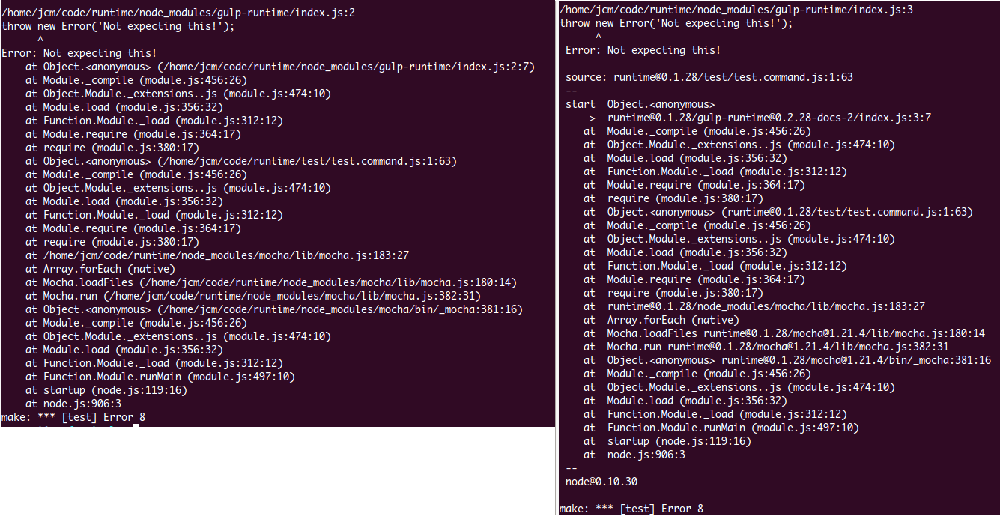

#

## Herro
> Humanize the `Error` class

The aim of this project is to humanize stack traces writing package's versions and names directly on the table.

## example

Say you have the stack trace of the left. Why shouldn't it look like what is on the right (note that instead of `node_modules/moduleName` you see `moduleName@version`)

## license

