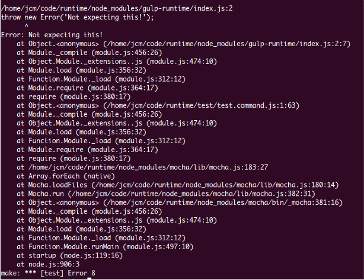

#

[](http://img.shields.io/npm/dm/herro.svg)
[](http://www.npmjs.org/package/herro)
[](https://travis-ci.org/stringparser/herro/builds)

## herro
> Humanize the `Error` class[](https://github.com/fehmicansaglam/progressed.io)

The aim of this project is to humanize stack traces writing package's versions and names directly on the table.

## example

Say you have this stack.

[](https://github.com/stringparser/runtime)

What if looked like this?

[](https://github.com/stringparser/runtime)
> note that instead of `node_modules/moduleName` you see `moduleName@version`

## install

```
npm install herro --save
```

## usage

Out of the package you get a plain old `Error` class that only takes one argument (the message to be written).

```js
var Herror = require('herro').Herror;
```

Just use it as you normally would and you would get stack traces like above.

Also, if you want to enforce *any* v8 stacktrace to have the package names and versions written there is a flag you can use for that

```sh
export FLOOD=true node index.js
```

Besides of the simple `Herror` class there are two methods to easily customize your errors (see the [api](#api) section below).

```js
var herro = require('herro');

herro.set('my-custom-error', function(err){

  err.message = error.message + ' with orange juice please';

  return err;
});

var myErrorClass = herror.get('my-custom-error');

throw new myErrorClass('I would want coffee and toasts');
// or also
throw new herror.get('my-custom-error', 'I would want coffee and toasts')
```

which as you would guess will `throw`

```sh
throw new myErrorClass('I would want coffee and toasts')
      ^
 Error: I would want coffee and toasts with orange juice please

 source: herro@0.0.16/lib/herro.js:103:19
 --
    >  new errorClass (herro@0.0.16/lib/herro.js:103:19)
   at  Object.<anonymous> (herro@0.0.16/test/test.Herror.set.js:47:7)
   at  Module._compile (module.js:456:26)
   at  Object.Module._extensions..js (module.js:474:10)
   at  Module.load (module.js:356:32)
   at  Function.Module._load (module.js:312:12)
   at  Function.Module.runMain (module.js:497:10)
   at  startup (node.js:119:16)
   at  node.js:906:3
 --
 node@0.10.30
```

## api

## license

[](http://opensource.org/licenses/MIT)
